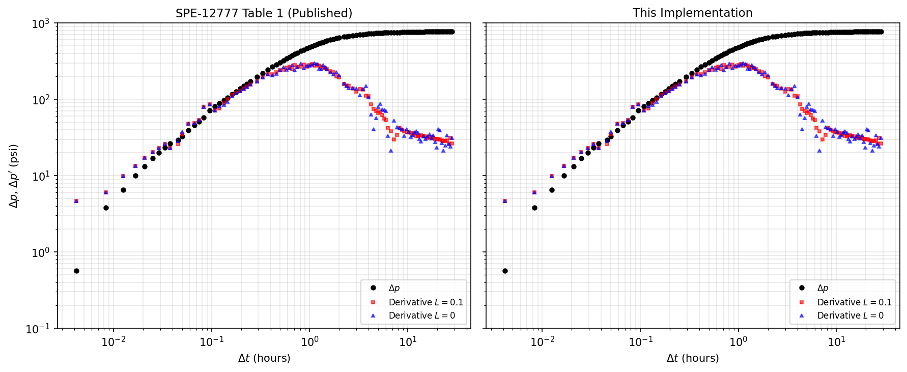
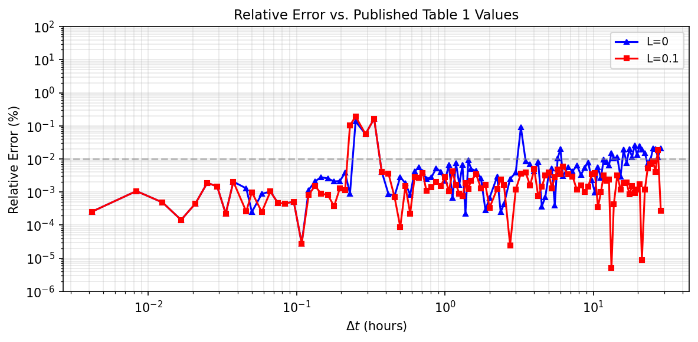

===================================
Bourdet Derivative Implementation
===================================

This document describes the ``petbox-dca`` implementation of the Bourdet
three-point derivative smoothing algorithm and its differences from the
original formulation in SPE-12777.

Reference
---------

Bourdet, D., Ayoub, J. A., and Pirard, Y. M. 1989. Use of Pressure
Derivative in Well-Test Interpretation. SPE Form Eval 4 (2): 293--302.
SPE-12777-PA. https://doi.org/10.2118/12777-PA.

Core Algorithm
--------------

The implementation follows Eq. 8 of SPE-12777 exactly. For each data
point *i*, the derivative is computed as the weighted mean of the left
and right slopes:

.. math::

    \left(\frac{dp}{dX}\right)_i =
    \frac{\frac{\Delta p_1}{\Delta X_1} \Delta X_2
    + \frac{\Delta p_2}{\Delta X_2} \Delta X_1}
    {\Delta X_1 + \Delta X_2}

where subscript 1 denotes the left neighbor and subscript 2 denotes
the right neighbor, selected as the first points beyond distance *L*
from point *i* on the log-transformed x-axis.

Implementation Differences
--------------------------

Smoothing parameter units
^^^^^^^^^^^^^^^^^^^^^^^^^

The original paper defines *L* in natural-log units (i.e., the
distance on the ``ln(t)`` axis). The ``petbox-dca`` implementation
defines *L* in log10 units (decades), consistent with the convention
that production data and well-test plots typically use base-10
logarithmic axes.

To convert between the two conventions::

    L_log10 = L_paper / ln(10)

For example, the paper's ``L = 0.1`` corresponds to ``L = 0.0434``
in this implementation. The typical smoothing range of 0.1--0.5 in
the paper corresponds to approximately 0.04--0.22 in ``petbox-dca``.

Edge handling
^^^^^^^^^^^^^

**SPE-12777 approach.** The paper defines three regions:

1. **Left edge** (first *k1* points): simple forward difference.
2. **Interior** (*k1* to *k2*): three-point Bourdet formula.
3. **Right edge** (last *n - k2* points): simple backward difference.

The transitions between regions can produce discontinuities in the
derivative curve. Edge points computed by two-point difference are
also more sensitive to noise than interior points.

**petbox-dca approach.** The three-point formula is applied to all
points. When a point lacks a valid neighbor on one side (i.e., it is
at the boundary of the data), the formula gracefully degrades:

- If only the left neighbor is available (last point): the derivative
  reduces to the left slope, ``Δp₁ / ΔX₁``.
- If only the right neighbor is available (first point): the derivative
  reduces to the right slope, ``Δp₂ / ΔX₂``.

This eliminates the edge/interior discontinuity and produces a
continuous derivative curve at all points. The one-sided fallback is
mathematically equivalent to the paper's forward/backward difference
for points at the data boundaries, but uses the same code path.

Neighbor selection
^^^^^^^^^^^^^^^^^^

Both the paper and this implementation select the first data point
beyond distance *L*. The search is performed using
``numpy.searchsorted`` on the sorted log-transformed x-array, which
provides O(log N) lookup per point and O(N log N) overall, compared
to the O(N²) approach of scanning subarrays for each point.

For ``L = 0``, consecutive points (``i - 1`` and ``i + 1``) are used
directly, bypassing the search entirely.

Validation
----------

The implementation was validated against the published Table 1 of
SPE-12777 (Buildup 2, 54 data points) at both ``L = 0`` and
``L = 0.1`` (converted to log10 units).

   Log-log diagnostic plot comparing published Table 1 derivative
   values (left) with ``petbox-dca`` output (right). Pressure change
   (black circles), unsmoothed derivative (blue triangles, L=0), and
   smoothed derivative (red squares, L=0.1).

Interior points (those with full L-windows on both sides) match the
published values to within 0.01% relative error. Differences at
the data boundaries are expected because the published table is a
subset of a larger dataset; the missing points beyond the table
boundaries affect the neighbor selection at the edges.

   Relative error between the ``petbox-dca`` implementation and the
   published Table 1 values.

Usage
-----

The smoothing parameter ``L`` is specified in log10 cycles::

    import numpy as np
    from petbox import dca

    t = np.array([...])  # time
    q = np.array([...])  # rate or pressure

    # Unsmoothed derivative: dy / d[ln(x)]
    der = dca.bourdet(q, t, L=0.0)

    # Smoothed with L = 0.2 log10 cycles
    der_smooth = dca.bourdet(q, t, L=0.2)

    # Derivative without log-x weighting: dy / dx
    der_linear = dca.bourdet(q, t, L=0.2, xlog=False)

    # Derivative of log(y): d[ln(y)] / d[ln(x)]
    der_loglog = dca.bourdet(q, t, L=0.2, ylog=True)
