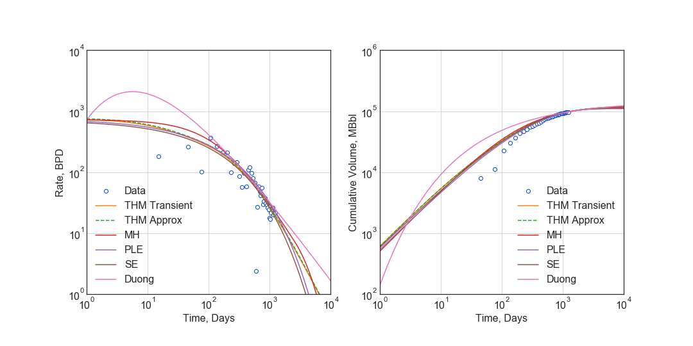
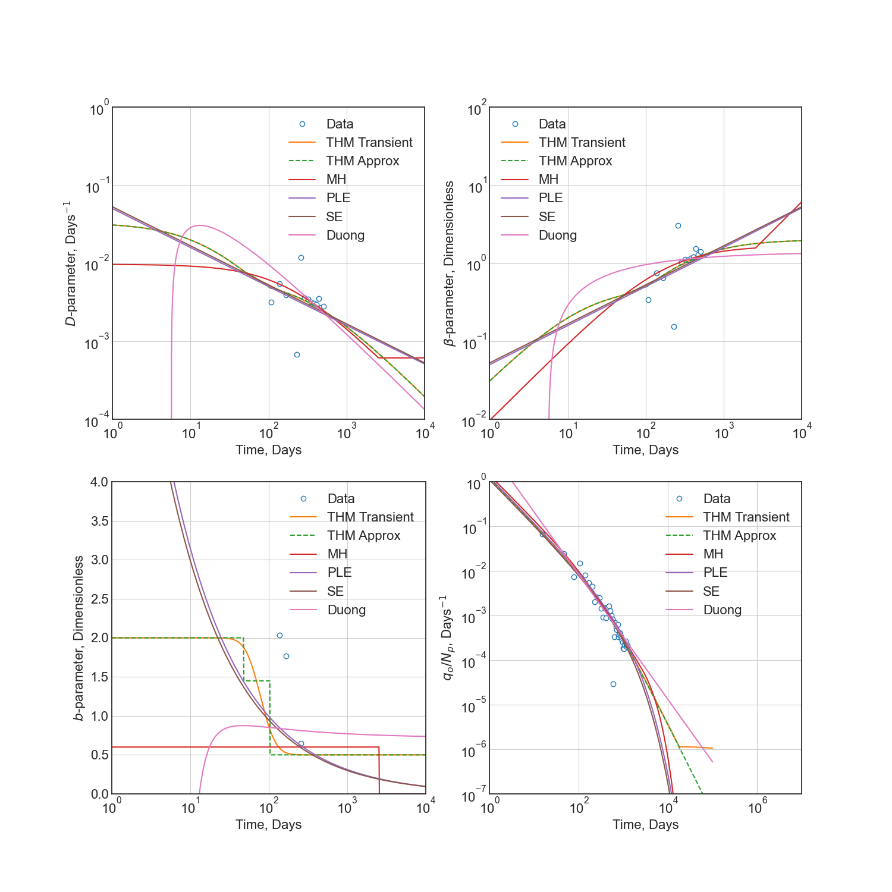
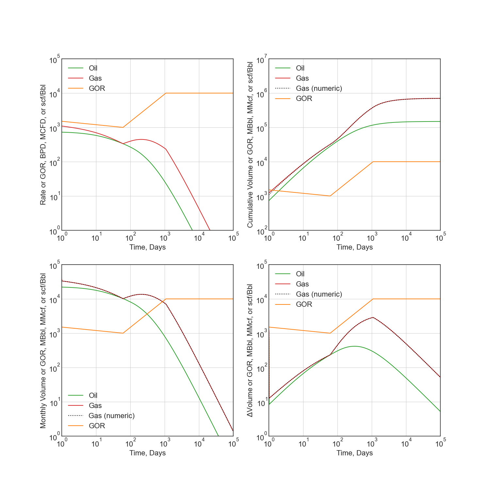
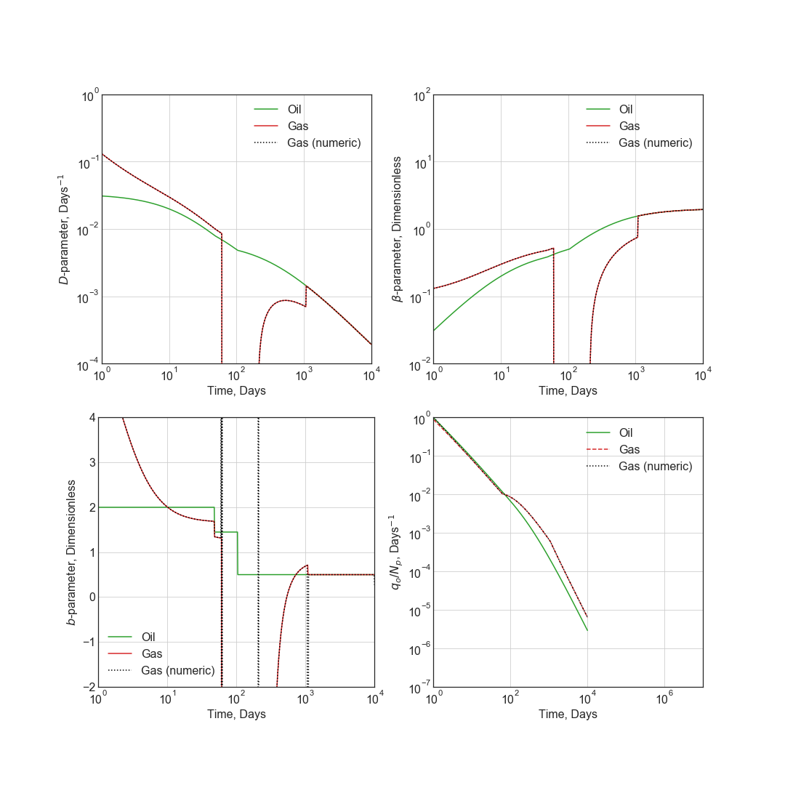
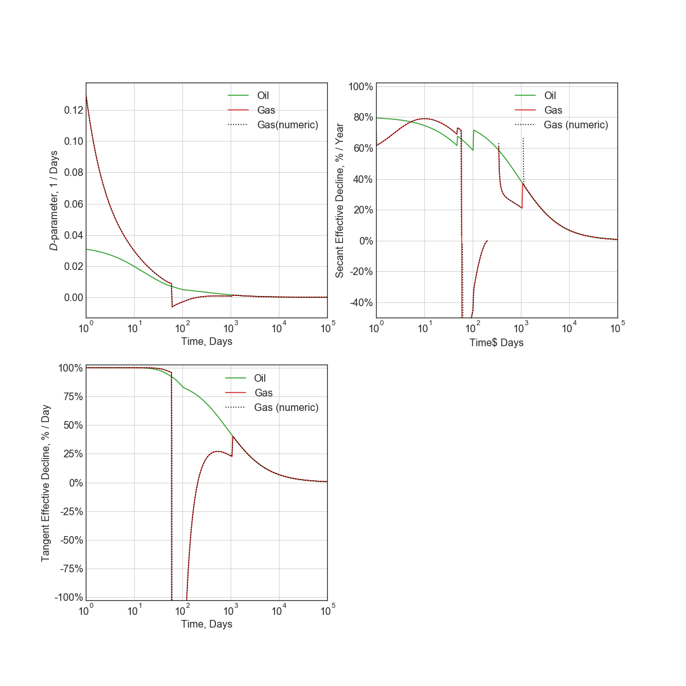

=======================
Detailed Usage Examples
=======================

Each model, including the secondary phase models, implements all diagnostic functions. The following is a set of examples to highlight functionality.

.. code-block:: python

    from petbox import dca
    from data import rate as data_q, time as data_t
    import numpy as np
    import matplotlib.pyplot as plt
    import matplotlib as mpl

    plt.style.use('seaborn-white')
    plt.rcParams['font.size'] = 16

.. code-block:: python

    # Setup time series for Forecasts and calculate cumulative production of data

    # We have this function handy
    t = dca.get_time(n=1001)

    # Calculate cumulative volume array of data
    data_N = np.cumsum(data_q * np.diff(data_t, prepend=data_t[0]))

    # Calculate diagnostic functions D, beta, and b
    data_D = -dca.bourdet(data_q, data_t, L=0.35, xlog=False, ylog=True)
    data_beta = data_D * data_t
    data_b = dca.bourdet(1 / data_D, data_t, L=0.25, xlog=False, ylog=False)

Primary Phase Decline Curve Models
==================================

Modified Hyperbolic Model
-------------------------

*Robertson, S. 1988. Generalized Hyperbolic Equation. Available from SPE, Richardson, Texas, USA. SPE-18731-MS.*

.. code-block:: python

    mh = dca.MH(qi=725, Di=0.85, bi=0.6, Dterm=0.2)
    q_mh = mh.rate(t)
    N_mh = mh.cum(t)
    D_mh = mh.D(t)
    b_mh = mh.b(t)
    beta_mh = mh.beta(t)
    N_mh *= data_N[-1] / mh.cum(data_t[-1])

Transient Hyperbolic Model
--------------------------

*Fulford, D. S., and Blasingame, T. A. 2013. Evaluation of Time-Rate Performance of Shale Wells using the Transient Hyperbolic Relation. Presented at SPE Unconventional Resources Conference – Canada in Calgary, Alberta, Canda, 5–7 November. SPE-167242-MS. https://doi.org/10.2118/167242-MS.*

.. code-block:: python

    thm = dca.THM(qi=750, Di=.8, bi=2, bf=.5, telf=28)
    q_trans = thm.transient_rate(t)
    N_trans = thm.transient_cum(t)
    D_trans = thm.transient_D(t)
    b_trans = thm.transient_b(t)
    beta_trans = thm.transient_beta(t)
    N_trans *= data_N[-1] / thm.transient_cum(data_t[-1])

Transient Hyperbolic Model Analytic Approximation
-------------------------------------------------

*Fulford, D.S. 2018. A Model-Based Diagnostic Workflow for Time-Rate Performance of Unconventional Wells. Presented at Unconventional Resources Conference in Houston, Texas, USA, 23–25 July. URTeC-2903036. https://doi.org/10.15530/urtec-2018-2903036.*

.. code-block:: python

    q_thm = thm.rate(t)
    N_thm = thm.cum(t)
    D_thm = thm.D(t)
    b_thm = thm.b(t)
    beta_thm = thm.beta(t)
    N_thm *= data_N[-1] / thm.cum(data_t[-1])

Timing Comparison
~~~~~~~~~~~~~~~~~

If performance is a consideration, the approximation is much faster.

.. code-block:: python

    >>> %timeit thm.transient_rate(t)
    64.9 ms ± 5.81 ms per loop (mean ± std. dev. of 7 runs, 10 loops each)

.. code-block:: python

    >>> %timeit thm.rate(t)
    86.9 µs ± 5.35 µs per loop (mean ± std. dev. of 7 runs, 10000 loops each)``

Power-Law Exponential Model
---------------------------

*Ilk, D., Perego, A. D., Rushing, J. A., and Blasingame, T. A. 2008. Exponential vs. Hyperbolic Decline in Tight Gas Sands – Understanding the Origin and Implications for Reserve Estimates Using Arps Decline Curves. Presented at SPE Annual Technical Conference and Exhibition in Denver, Colorado, USA, 21–24 September. SPE-116731-MS. https://doi.org/10.2118/116731-MS.*

*Ilk, D., Rushing, J. A., and Blasingame, T. A. 2009. Decline Curve Analysis for HP/HT Gas Wells: Theory and Applications. Presented at SPE Annual Technical Conference and Exhibition in New Orleands, Louisiana, USA, 4–7 October. SPE-125031-MS. https://doi.org/10.2118/125031-MS.*

.. code-block:: python

    ple = dca.PLE(qi=750, Di=.1, Dinf=.00001, n=.5)
    q_ple = ple.rate(t)
    N_ple = ple.cum(t)
    D_ple = ple.D(t)
    b_ple = ple.b(t)
    beta_ple = ple.beta(t)
    N_ple *= data_N[-1] /  ple.cum(data_t[-1])

Stretched Exponential
---------------------

*Valkó, P. P. Assigning Value to Stimulation in the Barnett Shale: A Simultaneous Analysis of 7000 Plus Production Histories and Well Completion Records. 2009. Presented at SPE Hydraulic Fracturing Technology Conference in College Station, Texas, USA, 19–21 January. SPE-119369-MS. https://doi.org/10.2118/119369-MS.*

.. code-block:: python

    se = dca.SE(qi=715, tau=90.0, n=.5)
    q_se = se.rate(t)
    N_se = se.cum(t)
    D_se = se.D(t)
    b_se = se.b(t)
    beta_se = se.beta(t)
    N_se *= data_N[-1] / se.cum(data_t[-1])

Duong Model
-----------

*Duong, A. N. 2001. Rate-Decline Analysis for Fracture-Dominated Shale Reservoirs. SPE Res Eval & Eng 14 (3): 377–387. SPE-137748-PA. https://doi.org/10.2118/137748-PA.*

.. code-block:: python

    dg = dca.Duong(qi=715, a=2.8, m=1.4)
    q_dg = dg.rate(t)
    N_dg = dg.cum(t)
    D_dg = dg.D(t)
    b_dg = dg.b(t)
    beta_dg = dg.beta(t)
    N_dg *= data_N[-1] / dg.cum(data_t[-1])

Primary Phase Diagnostic Plots
==============================

Rate and Cumulative Production Plots
------------------------------------

.. code-block:: python

    # Rate vs Time
    fig = plt.figure(figsize=(15, 7.5))
    ax1 = fig.add_subplot(121)
    ax2 = fig.add_subplot(122)

    ax1.plot(data_t, data_q, 'o', mfc='w', label='Data')
    ax1.plot(t, q_thm, label='THM Transient')
    ax1.plot(t, q_trans, ls='--', label='THM Approx')
    ax1.plot(t, q_mh, label='MH')
    ax1.plot(t, q_ple, label='PLE')
    ax1.plot(t, q_se, label='SE')
    ax1.plot(t, q_dg, label='Duong')

    ax1.set(xscale='log', yscale='log', ylabel='Rate, BPD', xlabel='Time, Days')
    ax1.set(ylim=(1e0, 1e4), xlim=(1e0, 1e4))
    ax1.set_aspect(1)
    ax1.grid()
    ax1.legend()

    # Cumulative Volume vs Time
    ax2.plot(data_t, data_N, 'o', mfc='w', label='Data')
    ax2.plot(t, N_trans, label='THM Transient')
    ax2.plot(t, N_thm, ls='--', label='THM Approx')
    ax2.plot(t, N_mh, label='MH')
    ax2.plot(t, N_ple, label='PLE')
    ax2.plot(t, N_se, label='SE')
    ax2.plot(t, N_dg, label='Duong')

    ax2.set(xscale='log', yscale='log', ylim=(1e2, 1e6), xlim=(1e0, 1e4))
    ax2.set(ylabel='Cumulative Volume, MBbl', xlabel='Time, Days')
    ax2.set_aspect(1)
    ax2.grid()
    ax2.legend()

    plt.savefig(img_path / 'model.png')

Diagnostic Function Plots
-------------------------

.. code-block:: python

    fig = plt.figure(figsize=(15, 15))
    ax1 = fig.add_subplot(221)
    ax2 = fig.add_subplot(222)
    ax3 = fig.add_subplot(223)
    ax4 = fig.add_subplot(224)

    # D-parameter vs Time
    ax1.plot(data_t, data_D, 'o', mfc='w', label='Data')
    ax1.plot(t, D_trans, label='THM Transient')
    ax1.plot(t, D_thm, ls='--', label='THM Approx')
    ax1.plot(t, D_mh, label='MH')
    ax1.plot(t, D_ple, label='PLE')
    ax1.plot(t, D_se, label='SE')
    ax1.plot(t, D_dg, label='Duong')
    ax1.set(xscale='log', yscale='log', ylim=(1e-4, 1e0))
    ax1.set(ylabel='$D$-parameter, Days$^{-1}$', xlabel='Time, Days')

    # beta-parameter vs Time
    ax2.plot(data_t, data_D * data_t, 'o', mfc='w', label='Data')
    ax2.plot(t, beta_trans, label='THM Transient')
    ax2.plot(t, beta_thm, ls='--', label='THM Approx')
    ax2.plot(t, beta_mh, label='MH')
    ax2.plot(t, beta_ple, label='PLE')
    ax2.plot(t, beta_se, label='SE')
    ax2.plot(t, beta_dg, label='Duong')
    ax2.set(xscale='log', yscale='log', ylim=(1e-2, 1e2))
    ax2.set(ylabel=r'$\beta$-parameter, Dimensionless', xlabel='Time, Days')

    # b-parameter vs Time
    ax3.plot(data_t, data_b, 'o', mfc='w', label='Data')
    ax3.plot(t, b_trans, label='THM Transient')
    ax3.plot(t, b_thm, ls='--', label='THM Approx')
    ax3.plot(t, b_mh, label='MH')
    ax3.plot(t, b_ple, label='PLE')
    ax3.plot(t, b_se, label='SE')
    ax3.plot(t, b_dg, label='Duong')
    ax3.set(xscale='log', yscale='linear', ylim=(0., 4.))
    ax3.set(ylabel='$b$-parameter, Dimensionless', xlabel='Time, Days')

    # q/N vs Time
    ax4.plot(data_t, data_q / data_N, 'o', mfc='w', label='Data')
    ax4.plot(t, q_trans / N_trans, label='THM Transient')
    ax4.plot(t, q_thm / N_thm, ls='--', label='THM Approx')
    ax4.plot(t, q_mh / N_mh, label='MH')
    ax4.plot(t, q_ple / N_ple, label='PLE')
    ax4.plot(t, q_se / N_se, label='SE')
    ax4.plot(t, q_dg / N_dg, label='Duong')
    ax4.set(xscale='log', yscale='log', ylim=(1e-7, 1e0), xlim=(1e0, 1e7))
    ax4.set(ylabel='$q_o / N_p$, Days$^{-1}$', xlabel='Time, Days')

    for ax in [ax1, ax2, ax3, ax4]:
        if ax != ax4:
            ax.set(xlim=(1e0, 1e4))
        if ax != ax3:
            ax.set_aspect(1)
        ax.grid()
        ax.legend()

    plt.savefig(img_path / 'diagnostics.png')

Secondary Phase Decline Curve Models
====================================

Power-Law GOR/CGR Model
-----------------------

*Fulford, D.S. 2018. A Model-Based Diagnostic Workflow for Time-Rate Performance of Unconventional Wells. Presented at Unconventional Resources Conference in Houston, Texas, USA, 23–25 July. URTeC-2903036. https://doi.org/10.15530/urtec-2018-2903036.*

.. code-block:: python

    thm = dca.THM(qi=750, Di=.8, bi=2, bf=.5, telf=28)
    thm.add_secondary(dca.Yield(c=1000, m0=-0.1, m=0.8, t0=2 * 365.25 / 12, max=10_000))

Secondary Phase Diagnostic Plots
================================

Rate and Cumluative Production Plots
------------------------------------

Numeric calculation provided to verify analytic relationships

.. code-block:: python

    fig = plt.figure(figsize=(15, 15))
    ax1 = fig.add_subplot(221)
    ax2 = fig.add_subplot(222)
    ax3 = fig.add_subplot(223)
    ax4 = fig.add_subplot(224)

    # Rate vs Time
    q = thm.rate(t)
    g = thm.secondary.rate(t)
    y = thm.secondary.gor(t)

    ax1.plot(t, q, c='C2', label='Oil')
    ax1.plot(t, g, c='C3', label='Gas')
    ax1.plot(t, y, c='C1', label='GOR')
    ax1.set(xscale='log', yscale='log', xlim=(1e0, 1e5), ylim=(1e0, 1e5))
    ax1.set(ylabel='Rate, BPD or MCFD', xlabel='Time, Days')

    # Cumulative Volume vs Time
    q_N = thm.cum(t)
    g_N = thm.secondary.cum(t)
    _g_N = np.cumsum(g_q * np.diff(t, prepend=0))

    ax2.plot(t, q_N, c='C2', label='Oil')
    ax2.plot(t, g_N, c='C3', label='Gas')
    ax2.plot(t, _g_N, c='k', ls=':', label='Gas (numeric)')
    ax2.plot(t, y, c='C1', label='GOR')
    ax2.set(xscale='log', yscale='log', xlim=(1e0, 1e5), ylim=(1e2, 1e7))
    ax2.set(ylabel='Rate, Dimensionless', xlabel='Time, Days')
    ax2.set(ylabel='Cumulative Volume or GOR, MBbl, MMcf, or Bbl/scf', xlabel='Time, Days')

    # Time vs Monthly Volume
    q_MN = thm.monthly_vol(t, t0=0.0)
    g_MN = thm.secondary.monthly_vol(t, t0=0.0)
    _g_MN = np.diff(np.cumsum(g_q * np.diff(t, prepend=0)), prepend=0) \
        / np.diff(t, prepend=0) * dca.DAYS_PER_MONTH

    ax3.plot(t, q_MN, c='C2', label='Oil')
    ax3.plot(t, g_MN, c='C3', label='Gas')
    ax3.plot(t, _g_MN, c='k', ls=':', label='Gas (numeric)')
    ax3.plot(t, y, c='C1', label='GOR')
    ax3.set(xscale='log', yscale='log', xlim=(1e0, 1e5), ylim=(1e0, 1e5))
    ax3.set(ylabel='Monthly Volume or GOR, MBbl, MMcf, or Bbl/scf', xlabel='Time, Days')

    # Time vs Interval Volume
    q_IN = thm.interval_vol(t, t0=0.0)
    g_IN = thm.secondary.interval_vol(t, t0=0.0)
    _g_IN = np.diff(np.cumsum(g_q * np.diff(t, prepend=0)), prepend=0)

    ax4.plot(t, q_IN, c='C2', label='Oil')
    ax4.plot(t, g_IN, c='C3', label='Gas')
    ax4.plot(t, _g_IN, c='k', ls=':', label='Gas (numeric)')
    ax4.plot(t, y, c='C1', label='GOR')
    ax4.set(xscale='log', yscale='log', xlim=(1e0, 1e5), ylim=(1e0, 1e5))
    ax4.set(ylabel='$\Delta$Volume or GOR, MBbl, MMcf, or Bbl/scf', xlabel='Time, Days')

    for ax in [ax1, ax2, ax3, ax4]:
        ax.set_aspect(1)
        ax.grid()
        ax.legend()

    plt.savefig(img_path / 'secondary_model.png')

Diagnotic Function Plots
------------------------

.. code-block:: python

    fig = plt.figure(figsize=(15, 15))
    ax1 = fig.add_subplot(221)
    ax2 = fig.add_subplot(222)
    ax3 = fig.add_subplot(223)
    ax4 = fig.add_subplot(224)

    # D-parameter vs Time
    q_D = thm.D(t)
    g_D = thm.secondary.D(t)
    _g_D = -np.gradient(np.log(thm.secondary.rate(t)), t)

    ax1.plot(t, q_D, c='C2', label='Oil')
    ax1.plot(t, g_D, c='C3', label='Gas')
    ax1.plot(t, _g_D, c='k', ls=':', label='Gas (numeric)')
    ax1.set(xscale='log', yscale='log', xlim=(1e0, 1e4), ylim=(1e-4, 1e0))
    ax1.set(ylabel='$D$-parameter, Days$^{-1}$', xlabel='Time, Days')

    # beta-parameter vs Time
    q_beta = thm.beta(t)
    g_beta = thm.secondary.beta(t)
    _g_beta = _g_D * t

    ax2.plot(t, q_beta, c='C2', label='Oil')
    ax2.plot(t, g_beta, c='C3', label='Gas')
    ax2.plot(t, _g_beta, c='k', ls=':', label='Gas (numeric)')
    ax2.set(xscale='log', yscale='log', xlim=(1e0, 1e4), ylim=(1e-2, 1e2))
    ax2.set(ylabel=r'$\beta$-parameter, Dimensionless', xlabel='Time, Days')

    # b-parameter vs Time
    q_b = thm.b(t)
    g_b = thm.secondary.b(t)
    _g_b = np.gradient(1.0 / _g_D, t)

    ax3.plot(t, q_b, c='C2', label='Oil')
    ax3.plot(t, g_b, c='C3', label='Gas')
    ax3.plot(t, _g_b, c='k', ls=':', label='Gas (numeric)')
    ax3.set(xscale='log', yscale='linear', xlim=(1e0, 1e4), ylim=(-2, 4))
    ax3.set(ylabel='$b$-parameter, Dimensionless', xlabel='Time, Days')

    # q/N vs Time
    q_Ng = thm.rate(t) / thm.cum(t)
    g_Ng = thm.secondary.rate(t) / thm.secondary.cum(t)
    _g_Ng = thm.secondary.rate(t) / np.cumsum(g_q * np.diff(t, prepend=0))

    ax4.plot(t, q_Ng, c='C2', label='Oil')
    ax4.plot(t, g_Ng, c='C3', ls='--', label='Gas')
    ax4.plot(t, _g_Ng, c='k', ls=':', label='Gas (numeric)')
    ax4.set(xscale='log', yscale='log', ylim=(1e-7, 1e0), xlim=(1e0, 1e7))
    ax4.set(ylabel='$q_o / N_p$, Days$^{-1}$', xlabel='Time, Days')

    for ax in [ax1, ax2, ax3, ax4]:
        if ax != ax3:
            ax.set_aspect(1)
        ax.grid()
        ax.legend()

    plt.savefig(img_path / 'sec_diagnostic_funs.png')

Additional Diagnostic Plots
---------------------------

Numeric calculation provided to verify analytic relationships

.. code-block:: python

    fig = plt.figure(figsize=(15, 15))
    ax1 = fig.add_subplot(221)
    ax2 = fig.add_subplot(222)
    ax3 = fig.add_subplot(223)

    # D-parameter vs Time
    q_D = thm.D(t)
    g_D = thm.secondary.D(t)
    _g_D = -np.gradient(np.log(thm.secondary.rate(t)), t)

    ax1.plot(t, q_D, c='C2', label='Oil')
    ax1.plot(t, g_D, c='C3', label='Gas')
    ax1.plot(t, _g_D, c='k', ls=':', label='Gas(numeric)')
    ax1.set(xscale='log', yscale='linear', xlim=(1e0, 1e5), ylim=(None, None))
    ax1.set(ylabel='$D$-parameter, 1 / Days', xlabel='Time, Days')

    # Secant Effective Decline vs Time
    secant_from_nominal = dca.MultisegmentHyperbolic.secant_from_nominal
    dpy = dca.DAYS_PER_YEAR

    q_Dn = [secant_from_nominal(d * dpy, b) for d, b in zip(q_D, thm.b(t))]
    g_Dn = [secant_from_nominal(d * dpy, b) for d, b in zip(g_D, thm.secondary.b(t))]
    _g_Dn = [secant_from_nominal(d * dpy, b) for d, b in zip(_g_D, np.gradient(1 / _g_D, t))]

    ax2.plot(t, q_Dn, c='C2', label='Oil')
    ax2.plot(t, g_Dn, c='C3', label='Gas')
    ax2.plot(t, _g_Dn, c='k', ls=':', label='Gas (numeric)')
    ax2.set(xscale='log', yscale='linear', xlim=(1e0, 1e5), ylim=(-.5, 1.025))
    ax2.yaxis.set_major_formatter(mpl.ticker.PercentFormatter(xmax=1))
    ax2.set(ylabel='Secant Effective Decline, % / Year', xlabel='Time$ Days')

    # Tangent Effective Decline vs Time
    ax3.plot(t, 1 - np.exp(-q_D * dpy), c='C2', label='Oil')
    ax3.plot(t, 1 - np.exp(-g_D * dpy), c='C3', label='Gas')
    ax3.plot(t, 1 - np.exp(-_g_D * dpy), c='k', ls=':', label='Gas (numeric)')
    ax3.set(xscale='log', yscale='linear', xlim=(1e0, 1e5), ylim=(-1.025, 1.025))
    ax3.yaxis.set_major_formatter(mpl.ticker.PercentFormatter(xmax=1))
    ax3.set(ylabel='Tangent Effective Decline, % / Day', xlabel='Time, Days')

    for ax in [ax1, ax2, ax3]:
        ax.grid()
        ax.legend()

    plt.savefig(img_path / 'sec_decline_diagnostics.png')

