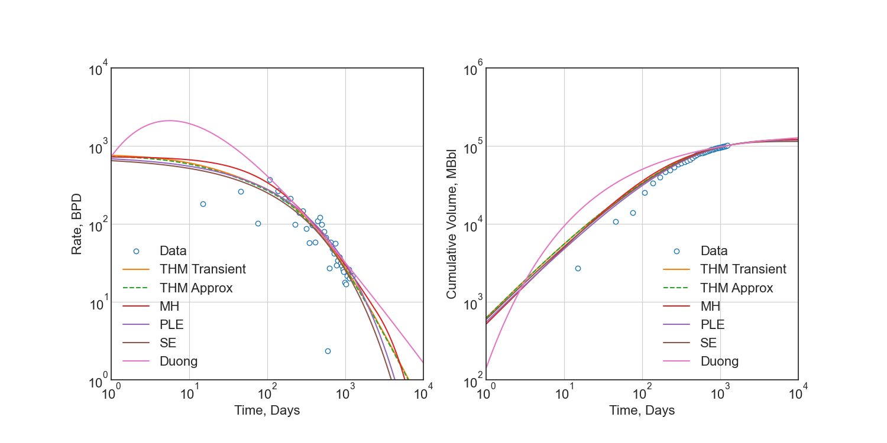
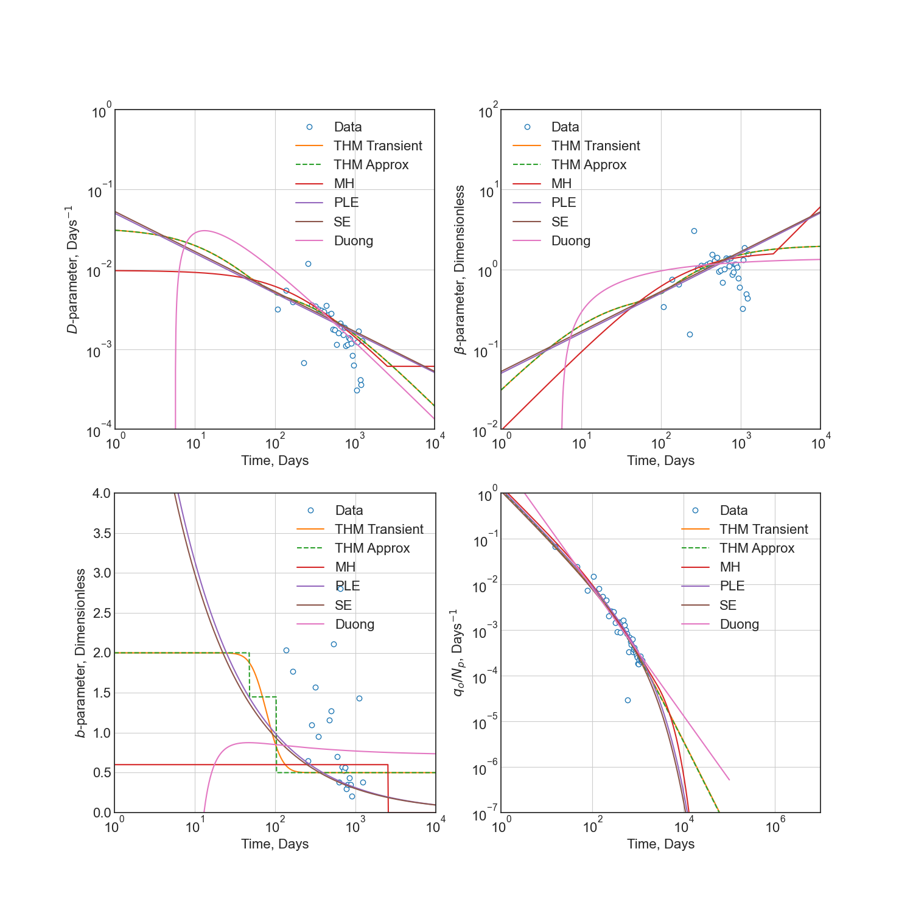
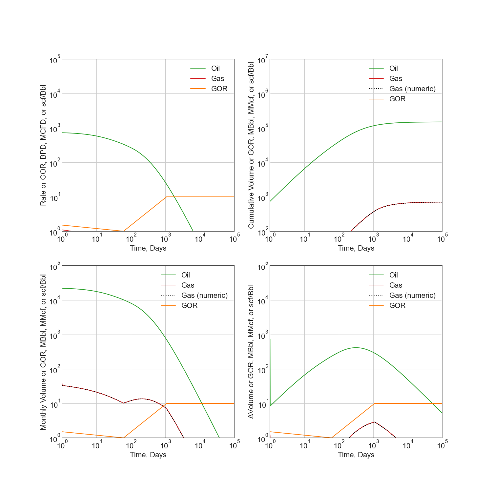
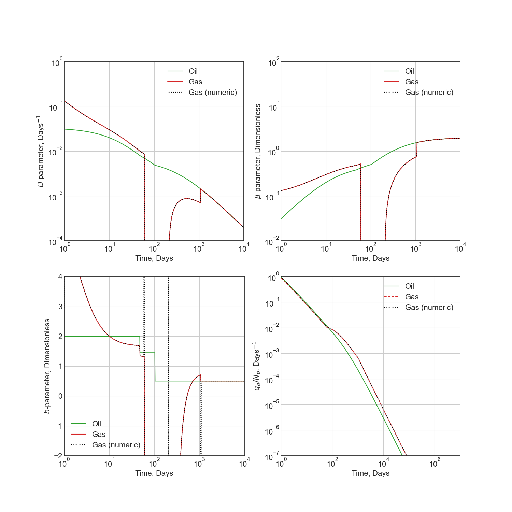
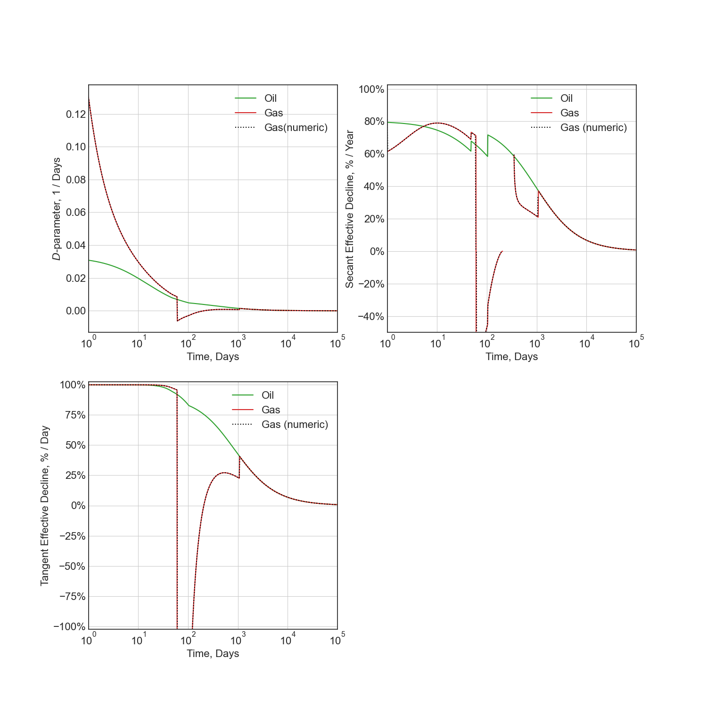
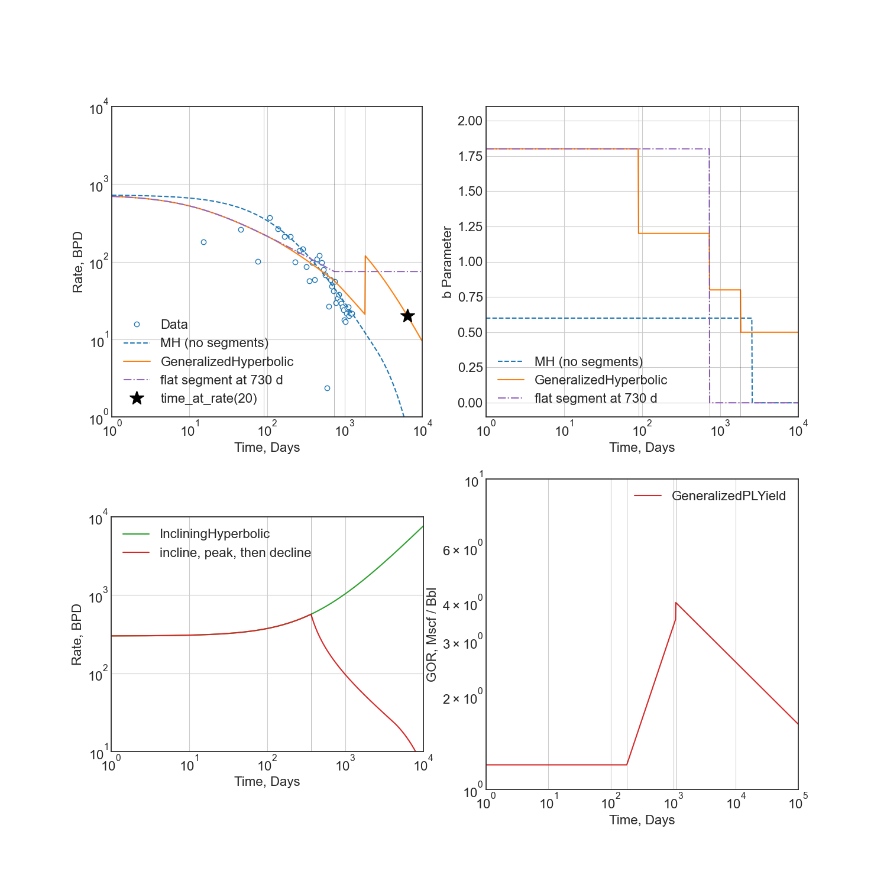

=======================
Detailed Usage Examples
=======================

Each model, including the secondary phase models, implements all diagnostic functions. The following is a set of examples to highlight functionality.

.. literalinclude:: ../test/doc_examples.py
    :language: python
    :start-after: # [begin example-00]
    :end-before: # [end example-00]

.. literalinclude:: ../test/doc_examples.py
    :language: python
    :start-after: # [begin example-01]
    :end-before: # [end example-01]

Primary Phase Decline Curve Models
==================================

Modified Hyperbolic Model
-------------------------

*Robertson, S. 1988. Generalized Hyperbolic Equation. Available from SPE, Richardson, Texas, USA. SPE-18731-MS.*

.. literalinclude:: ../test/doc_examples.py
    :language: python
    :start-after: # [begin example-02]
    :end-before: # [end example-02]

Transient Hyperbolic Model
--------------------------

*Fulford, D. S., and Blasingame, T. A. 2013. Evaluation of Time-Rate Performance of Shale Wells using the Transient Hyperbolic Relation. Presented at SPE Unconventional Resources Conference – Canada in Calgary, Alberta, Canda, 5–7 November. SPE-167242-MS. https://doi.org/10.2118/167242-MS.*

.. literalinclude:: ../test/doc_examples.py
    :language: python
    :start-after: # [begin example-03]
    :end-before: # [end example-03]

Transient Hyperbolic Model Analytic Approximation
-------------------------------------------------

*Fulford, D.S. 2018. A Model-Based Diagnostic Workflow for Time-Rate Performance of Unconventional Wells. Presented at Unconventional Resources Conference in Houston, Texas, USA, 23–25 July. URTeC-2903036. https://doi.org/10.15530/urtec-2018-2903036.*

.. literalinclude:: ../test/doc_examples.py
    :language: python
    :start-after: # [begin example-04]
    :end-before: # [end example-04]

Timing Comparison
~~~~~~~~~~~~~~~~~

If performance is a consideration, the approximation is much faster.

.. code-block:: python

    >>> %timeit thm.transient_rate(t)
    64.9 ms ± 5.81 ms per loop (mean ± std. dev. of 7 runs, 10 loops each)

.. code-block:: python

    >>> %timeit thm.rate(t)
    86.9 µs ± 5.35 µs per loop (mean ± std. dev. of 7 runs, 10000 loops each)``

Power-Law Exponential Model
---------------------------

*Ilk, D., Perego, A. D., Rushing, J. A., and Blasingame, T. A. 2008. Exponential vs. Hyperbolic Decline in Tight Gas Sands – Understanding the Origin and Implications for Reserve Estimates Using Arps Decline Curves. Presented at SPE Annual Technical Conference and Exhibition in Denver, Colorado, USA, 21–24 September. SPE-116731-MS. https://doi.org/10.2118/116731-MS.*

*Ilk, D., Rushing, J. A., and Blasingame, T. A. 2009. Decline Curve Analysis for HP/HT Gas Wells: Theory and Applications. Presented at SPE Annual Technical Conference and Exhibition in New Orleands, Louisiana, USA, 4–7 October. SPE-125031-MS. https://doi.org/10.2118/125031-MS.*

.. literalinclude:: ../test/doc_examples.py
    :language: python
    :start-after: # [begin example-07]
    :end-before: # [end example-07]

Stretched Exponential
---------------------

*Valkó, P. P. Assigning Value to Stimulation in the Barnett Shale: A Simultaneous Analysis of 7000 Plus Production Histories and Well Completion Records. 2009. Presented at SPE Hydraulic Fracturing Technology Conference in College Station, Texas, USA, 19–21 January. SPE-119369-MS. https://doi.org/10.2118/119369-MS.*

.. literalinclude:: ../test/doc_examples.py
    :language: python
    :start-after: # [begin example-08]
    :end-before: # [end example-08]

Duong Model
-----------

*Duong, A. N. 2001. Rate-Decline Analysis for Fracture-Dominated Shale Reservoirs. SPE Res Eval & Eng 14 (3): 377–387. SPE-137748-PA. https://doi.org/10.2118/137748-PA.*

.. literalinclude:: ../test/doc_examples.py
    :language: python
    :start-after: # [begin example-09]
    :end-before: # [end example-09]

Primary Phase Diagnostic Plots
==============================

Rate and Cumulative Production Plots
------------------------------------

.. literalinclude:: ../test/doc_examples.py
    :language: python
    :start-after: # [begin example-10]
    :end-before: # [end example-10]

Diagnostic Function Plots
-------------------------

.. literalinclude:: ../test/doc_examples.py
    :language: python
    :start-after: # [begin example-11]
    :end-before: # [end example-11]

Secondary Phase Decline Curve Models
====================================

Power-Law GOR/CGR Model
-----------------------

*Fulford, D.S. 2018. A Model-Based Diagnostic Workflow for Time-Rate Performance of Unconventional Wells. Presented at Unconventional Resources Conference in Houston, Texas, USA, 23–25 July. URTeC-2903036. https://doi.org/10.15530/urtec-2018-2903036.*

.. literalinclude:: ../test/doc_examples.py
    :language: python
    :start-after: # [begin example-12]
    :end-before: # [end example-12]

Secondary Phase Diagnostic Plots
================================

Rate and Cumluative Production Plots
------------------------------------

Numeric calculation provided to verify analytic relationships

.. literalinclude:: ../test/doc_examples.py
    :language: python
    :start-after: # [begin example-13]
    :end-before: # [end example-13]

Diagnostic Function Plots
-------------------------

.. literalinclude:: ../test/doc_examples.py
    :language: python
    :start-after: # [begin example-14]
    :end-before: # [end example-14]

Additional Diagnostic Plots
---------------------------

Numeric calculation provided to verify analytic relationships

.. literalinclude:: ../test/doc_examples.py
    :language: python
    :start-after: # [begin example-15]
    :end-before: # [end example-15]

Generalized and Inclining Models
================================

A ``GeneralizedHyperbolic`` takes an arbitrary number of segments, each continuous in rate and
decline with the one before it unless it overrides them. ``MH`` is its no-segment case. Segment
tuples are length-disambiguated: ``(t, b)``, ``(t, D, b)``, or ``(t, q, D, b)``.

An ``IncliningHyperbolic`` requires both ``Di`` and ``bi`` negative, so the rate rises. It
models one period -- a build-up -- and takes no ``Dterm``, since a rising rate never reaches
one. For the physical case, incline to a peak and then decline using both signs of segment.

``time_at_rate`` inverts the rate function, bracketing each segment before inverting it, so it
answers both time-to-economic-limit and how far a forecast can be backed up. The pole is simply
the infinite-rate limit.

Segment and Rate Inversion Plots
--------------------------------

.. literalinclude:: ../test/doc_examples.py
    :language: python
    :start-after: # [begin example-16]
    :end-before: # [end example-16]

