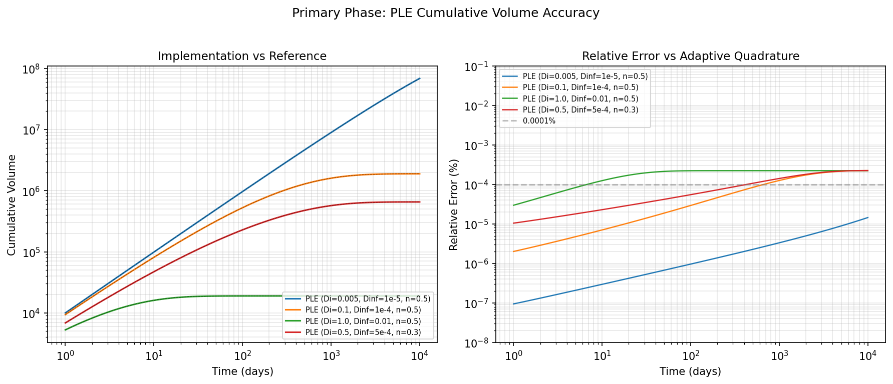
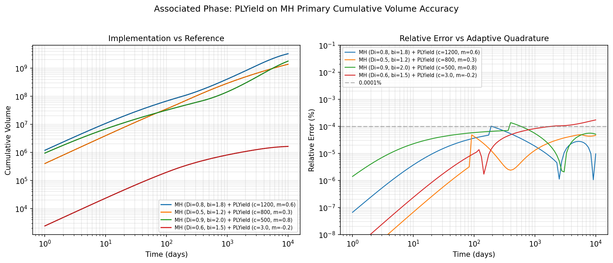

=============================
Numerical Integration Method
=============================

Several decline curve models in ``petbox-dca`` require numerical
integration to compute cumulative volume :math:`N(t)` from the rate
function :math:`q(t)`:

.. math::

    N(t) = \int_0^t q(\tau) \, d\tau

Models with closed-form cumulative solutions (MH, THM, SE, Duong) do
not use numerical integration, with one exception: the Stretched
Exponential (SE) closed form carries a :math:`\Gamma(1/n)` coefficient
that overflows for very small :math:`n` (:math:`n \lesssim 0.006`), where
SE falls back to the numerical method described here. The Power-Law
Exponential (PLE) model and associated phase models (PLYield) always use
this method.

Method
------

Integration is performed using ``scipy.integrate.cumulative_trapezoid``
on a dense log-spaced grid merged with the requested evaluation times.

**Algorithm:**

1. Construct a grid of 10,000 log-spaced points from :math:`10^{-12}`
   to :math:`t_{max}`, plus a point at :math:`t = 0`.
2. Merge the requested :math:`t` values into the grid (via
   ``numpy.unique``), ensuring exact evaluation at each requested time.
3. Evaluate :math:`q(t)` on the full grid in a single vectorized call.
4. Apply ``cumulative_trapezoid`` to obtain the cumulative integral at
   every grid point.
5. Extract values at the requested :math:`t` indices directly (no
   interpolation).

**Why log-spaced?** DCA rate functions typically have their steepest
gradients near :math:`t = 0` and flatten at late times. A log-spaced
grid concentrates evaluation points where the function changes most
rapidly, matching the natural scale of the problem. A uniform grid of
the same size would under-resolve the early-time region and waste points
at late times.

**Why merge with t?** By including the requested :math:`t` values in
the integration grid, the cumulative integral is evaluated exactly at
those points --- no interpolation error is introduced.

Grid Resolution
---------------

The default grid uses 10,000 log-spaced points. This was selected by
benchmarking against adaptive quadrature (``scipy.integrate.quad`` with
``limit=200``) across PLE models spanning mild to steep decline rates:

+----------------------------------------------+-----------------+------------------+
| Model                                        | Max Rel Err (%) | Mean Rel Err (%) |
+==============================================+=================+==================+
| PLE (Di=0.005, Dinf=1e-5, n=0.5) --- mild   |      1.4e-05    |       2.5e-06    |
+----------------------------------------------+-----------------+------------------+
| PLE (Di=0.1, Dinf=1e-4, n=0.5) --- moderate |      2.2e-04    |       7.0e-05    |
+----------------------------------------------+-----------------+------------------+
| PLE (Di=1.0, Dinf=0.01, n=0.5) --- steep    |      2.2e-04    |       1.7e-04    |
+----------------------------------------------+-----------------+------------------+
| PLE (Di=0.5, Dinf=5e-4, n=0.3)              |      2.2e-04    |       8.5e-05    |
+----------------------------------------------+-----------------+------------------+

All cases: :math:`q_i = 10{,}000`, evaluated at 101 log-spaced points
from 1 to 10,000 days. Reference computed with adaptive quadrature
(absolute tolerance :math:`\sim 10^{-14}`).

The worst-case maximum relative error is **0.00022%** (2.2 parts per
million), which is well below the uncertainty inherent in empirical
decline curve parameters. Mean errors are an order of magnitude smaller.

The grid size is configurable via the ``n_grid`` keyword, which flows
through ``cum(t, n_grid=...)`` (and the other volume methods). The
log-spaced trapezoid rule converges at second order --- each doubling of
``n_grid`` cuts the relative error roughly four-fold --- so the knob
trades accuracy for a proportional reduction in grid work. Worst-case
error over the four PLE cases above:

.. csv-table::
   :header: "n_grid", "Max Rel Err (%)", "Mean Rel Err (%)"
   :widths: 12, 20, 20

   "250",     "0.11",     "0.087"
   "500",     "0.056",    "0.044"
   "1,000",   "0.019",    "0.014"
   "2,000",   "0.0054",   "0.0041"
   "5,000",   "0.00087",  "0.00068"
   "10,000",  "0.00022",  "0.00017"
   "20,000",  "0.000056", "0.000044"

The default of 10,000 (:math:`\sim 2 \times 10^{-6}` relative error) is
unchanged. A smaller value such as 2,000 (:math:`\sim 5 \times 10^{-5}`)
remains far below the noise in empirical production data, and is a
reasonable choice when integrating repeatedly at moderate accuracy (e.g.
fitting on a fixed ``t``). ``n_grid`` must be :math:`\ge 2`; smaller
values raise ``ValueError``. For typical evaluation arrays the accuracy
is governed by ``n_grid`` rather than by the density of the requested
``t`` values --- the log-spaced grid dominates the merged integration
grid, so refining ``t`` alone does not improve accuracy.

   Left: cumulative volume curves for four PLE parameterizations.
   Implementation (solid) overlays the adaptive quadrature reference
   (dashed black). Right: relative error vs. time for each case.

Associated Phase Accuracy
-------------------------

Associated phase models (``PLYield``) also use numerical integration.
Their cumulative volume integrates the product of the yield function
and the primary phase rate:

.. math::

    N_{sec}(t) = \int_0^t \text{yield}(\tau) \cdot q_{primary}(\tau) \, d\tau

The following table shows accuracy for ``PLYield`` models attached to
``MH`` (Modified Hyperbolic) primary phases, covering rising, moderate,
steep, and declining yield profiles:

+-------------------------------------------------------+-----------------+------------------+
| Model                                                 | Max Rel Err (%) | Mean Rel Err (%) |
+=======================================================+=================+==================+
| MH (Di=0.8, bi=1.8) + PLYield (c=1200, m=0.6)       |      1.0e-04    |       2.1e-05    |
+-------------------------------------------------------+-----------------+------------------+
| MH (Di=0.5, bi=1.2) + PLYield (c=800, m=0.3)        |      4.9e-05    |       1.3e-05    |
+-------------------------------------------------------+-----------------+------------------+
| MH (Di=0.9, bi=2.0) + PLYield (c=500, m=0.8)        |      1.4e-04    |       4.0e-05    |
+-------------------------------------------------------+-----------------+------------------+
| MH (Di=0.6, bi=1.5) + PLYield (c=3.0, m=-0.2)       |      1.7e-04    |       4.0e-05    |
+-------------------------------------------------------+-----------------+------------------+

The worst-case maximum relative error for the associated phase is
**0.00017%**, comparable to the primary phase results. The product of
yield and rate is smoother than the PLE rate alone (the MH primary has
an analytical rate function), which helps the trapezoidal rule.

   Left: cumulative secondary-phase volume for four MH + PLYield
   configurations. Right: relative error vs. time for each case.

Performance
-----------

The log-spaced grid approach eliminates the Python-level loop that the
previous per-interval Gaussian quadrature required. All function
evaluations happen in a single vectorized NumPy call, and the
trapezoidal integration is performed by SciPy in compiled code.

Measured on a 101-point time array:

+---------------------------+-----------+--------------------+
| Method                    | Time (ms) | Max Rel Err (%)    |
+===========================+===========+====================+
| Per-interval fixed_quad   |    ~1.1   |    1.5e-04         |
+---------------------------+-----------+--------------------+
| Log-spaced trapezoid 10k  |    ~0.3   |    2.2e-04         |
+---------------------------+-----------+--------------------+

The ~3x speedup comes from replacing ~100 Python-level ``fixed_quad``
calls (each with its own function dispatch overhead) with a single
vectorized evaluation over 10,000 grid points.

Validation Script
-----------------

The accuracy results above can be reproduced by running::

    python docs/integration_validation.py

This script evaluates both primary phase (PLE) and associated phase
(PLYield on MH) models, computes reference cumulative volumes using
adaptive quadrature, and generates the accuracy figures.
